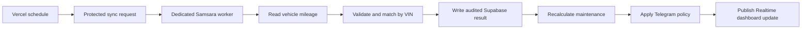
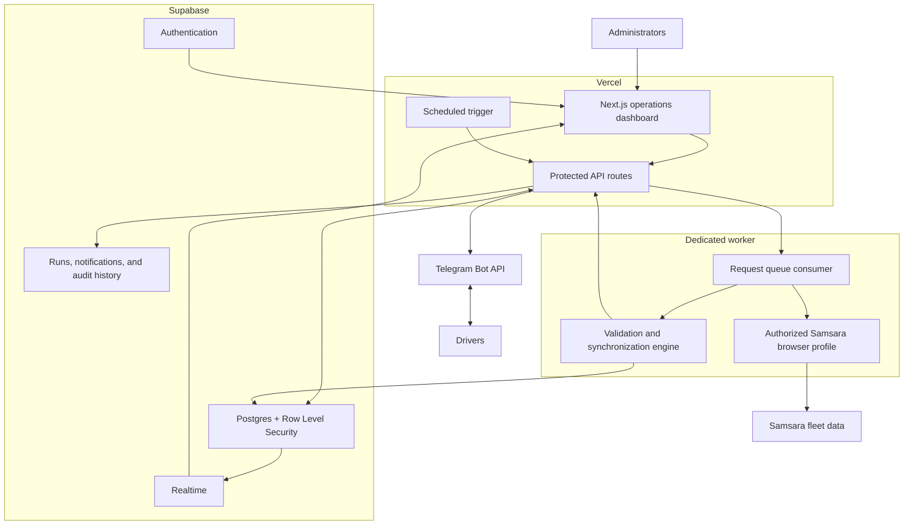

# Avengers Fleet Intelligence Dashboard

> A production fleet-maintenance command center connecting Samsara mileage, Supabase operational data, Telegram driver workflows, and Vercel-hosted automation.

[Open the production application](https://swoop-jarvis.vercel.app/) · [Return to the portfolio](../../README.md)


## Overview

Avengers Dashboard gives fleet administrators one place to understand vehicle mileage, service urgency, integration readiness, and notification activity. It replaces a fragmented process with a traceable workflow: collect mileage, validate it, update the system of record, evaluate maintenance, contact the right person, and preserve the result.

This repository contains the public portfolio case study and privacy-conscious screenshots. The production source code and credentials remain private.

## The business problem

Mileage originates in Samsara, maintenance rules need dependable current readings, driver follow-up happens in Telegram, and management needs proof that each automated step succeeded. Without a shared system, teams can miss thresholds, repeat reminders, overwrite trustworthy data after a failed read, or lose the history behind a decision.

The dashboard joins those responsibilities into one operational product with explicit security and failure boundaries.

## Core product features

### Fleet dashboard

- Fleet-wide counts for active, healthy, due-soon, and overdue vehicles
- Synced-vehicle coverage and mileage freshness at a glance
- Maintenance overview across oil change, transmission, and inspection schedules
- Priority queue ordered by service urgency
- Upcoming-maintenance planning view
- Weekly worker status, authentication readiness, last run, and next run
- Integration health for Supabase, Samsara, and Telegram
- Professional loading, empty, error, and responsive mobile states

### Vehicle and mileage management

- Vehicle list and detailed vehicle pages
- Driver, vehicle, license, VIN mapping, and service context
- Current mileage with source and last-update timestamp
- Freshness labels for current, recent, delayed, or stale data
- Manual mileage updates with validation
- Per-vehicle `Mileage Only`, `Admin Test`, and live-driver test modes
- Full-fleet manual synchronization
- Safe preservation of the last trusted value when extraction fails

### Maintenance intelligence

- Mileage-based oil-change, transmission-flush, and inspection schedules
- Healthy, due soon, due, and overdue states
- Automatic recalculation after valid mileage changes
- Priority ordering by miles remaining or miles overdue
- Audited `Mark service complete` workflow
- Maintenance history with the actor, reading, source, and timestamp
- No service mutation when a driver rejects a Telegram confirmation

### Operations and auditability

- Per-run completed, partial, and failed states
- Counts for discovered, updated, unmapped, and failed vehicles
- Telegram sent, failed, and duplicate-suppressed totals
- Run-detail pages for extraction and persistence outcomes
- Worker heartbeat and authentication state
- Vehicle mappings and integration readiness
- Notification, onboarding, command, and maintenance logs kept as distinct records

## Automation inventory

### 1. Weekly Samsara reconciliation

The scheduled worker runs a complete fleet reconciliation every Monday at the configured Central Time schedule.



The worker processes vehicles independently. A failed vehicle does not stop the remaining fleet, and failed extraction cannot replace a known mileage value with zero or blank data.

### 2. Manual full-fleet sync

An administrator can request the same controlled reconciliation without waiting for the weekly run. The request is queued, authenticated, claimed by the worker, and reported through the same audit trail.

### 3. Per-vehicle test sync

Each vehicle can be tested independently:

- **Mileage Only** verifies extraction and matching without starting the driver conversation.
- **Admin Test** exercises notification behavior against the configured administrator target.
- **Live Driver** uses the active driver workflow and its normal safety rules.

### 4. Maintenance notification automation

After a valid mileage update, the policy engine evaluates every supported service. A notification is eligible only when the resulting stage requires attention and the same stage has not already been delivered.

Stage-based deduplication prevents a weekly or manual sync from repeatedly sending the same warning. A new message becomes eligible when the underlying maintenance state materially changes.

### 5. Telegram driver onboarding

Drivers start the bot privately and confirm their identity. The connection record is stored without exposing bot credentials in the browser. Administrators can see whether each driver is connected, issue an invite, send a controlled test, or disconnect the relationship.

### 6. Closed-loop service completion

```mermaid
sequenceDiagram
    participant S as Sync engine
    participant T as Telegram assistant
    participant D as Driver
    participant DB as Supabase
    participant A as Administrator

    S->>T: Eligible maintenance alert
    T->>D: Was the service completed? YES / NO
    alt YES
        T->>D: Request current mileage
        D->>T: Mileage and optional mechanic
        T->>DB: Record completion and audit event
        DB-->>A: Realtime maintenance update
    else NO
        T->>DB: Record response; do not mutate service
    else Ignored or repeatedly declined
        T->>A: Escalate under configured policy
    end
```

### 7. Summaries and escalation

The settings surface supports daily driver summaries, a preferred local delivery time, escalation after repeated `NO` responses, escalation after ignored overdue items, and administrator or mechanic recipients. These controls are deliberately separate from the core maintenance calculation.

## AI-agent design

The product uses specialized agent-style responsibilities instead of giving one model unrestricted control:

| Agent responsibility | Inputs | Allowed output | Safety boundary |
| --- | --- | --- | --- |
| Mileage sync agent | Samsara readings, vehicle mappings | Validated mileage candidate and run result | Cannot invent mileage or replace trusted data after failure |
| Maintenance policy agent | Valid mileage, service intervals, completion history | Deterministic service state | Rules, not generated prose, own the final status |
| Telegram maintenance assistant | Eligible alert, driver identity, conversation state | Guided prompts, read-only answers, completion request | Mutations require the expected workflow state and validated input |
| Notification agent | Maintenance stage, recipient links, delivery history | Send, skip, or log failure | Stage-based deduplication and recipient authorization |
| Operations supervisor | Heartbeats, run outcomes, authentication state | Health state, pause, retry, or escalation | Authentication expiry pauses safely; it is never bypassed |

Optional AI explanations can make driver-facing wording clearer, but the factual mileage, threshold, authorization, and database decisions remain deterministic and auditable.

## System architecture



## Technology stack

| Layer | Technology | Purpose |
| --- | --- | --- |
| Application | Next.js, React, TypeScript | Server-rendered operations UI, actions, and API routes |
| Data | Supabase Postgres | Fleet records, maintenance state, sync queues, delivery logs, and audit history |
| Identity | Supabase Auth + RLS | Passwordless administrator access and database authorization |
| Live updates | Supabase Realtime | Refresh open dashboards after valid worker updates |
| Fleet source | Samsara | Authoritative vehicle mileage source |
| Messaging | Telegram Bot API | Driver onboarding, alerts, conversations, tests, summaries, and escalation |
| Hosting | Vercel | Production deployment, server runtime, environment separation, and scheduled trigger |
| Worker | Dedicated local browser worker | Uses the authorized Samsara session while keeping credentials and MFA outside the web app |

## Supabase implementation

- Authentication protects the internal dashboard and privileged actions.
- Row-level security applies authorization inside the database, not only in UI code.
- Fleet, service, synchronization, mapping, notification, authorization, and audit records are relational and server-controlled.
- Realtime publishes valid operational changes to connected dashboard clients.
- Service completion is handled as an audited workflow rather than a blind field edit.
- Public and privileged credentials are separated by runtime scope.

## Samsara integration

The dedicated worker reads mileage from an already authorized Samsara profile. This design preserves normal Samsara authentication and MFA instead of exporting browser cookies or embedding user credentials in Vercel.

The synchronization engine:

1. Claims an authenticated request.
2. Checks worker and Samsara readiness.
3. Discovers the requested vehicle set.
4. Extracts current mileage.
5. Validates the reading.
6. Matches the vehicle by stable identifiers such as VIN.
7. Writes the new reading and run detail.
8. Recalculates maintenance.
9. Evaluates Telegram eligibility.
10. Reports completion, partial success, or failure.

If the Samsara session expires, the worker pauses and surfaces that authentication is required. It does not bypass sign-in or MFA.

## Telegram integration

- Verified webhook requests
- Private driver onboarding and identity linking
- Bot command and response history
- Maintenance alerts with actionable buttons
- `YES` path for mileage and optional mechanic context
- `NO` path with no service mutation
- Administrator test messaging
- Broadcast tests for connected drivers
- Daily summaries and configurable timezone
- Administrator and mechanic escalation controls
- Delivery status, failure logging, and duplicate suppression

Bot tokens, webhook secrets, chat IDs, and user IDs are server-side and are not included in this case study.

## Vercel application layer

Vercel hosts the Next.js application and its protected server endpoints. Environment variables separate browser-safe Supabase configuration from privileged database, worker, Telegram, scheduling, and authorization secrets. Scheduled requests and ingestion endpoints require credentials and reject anonymous access.

The application uses the platform for deployment and scheduled orchestration; the authenticated Samsara browser work remains on the dedicated worker because it depends on a persistent, user-authorized browser profile.

## Screenshots

### Fleet health and synchronization coverage


### Connected services and execution policy


### Telegram notification and duplicate-suppression reporting


The screenshots are cropped from the authenticated production interface. Vehicle-level records, recipient identifiers, and all secret values are intentionally omitted.

## Security model

- Production secrets are server-only and never rendered by the integration settings page.
- Supabase RLS remains active even if a client attempts to call the database directly.
- Samsara authentication stays in its dedicated local browser profile.
- Telegram webhook and administrative actions require authorization.
- Sync and legacy automation endpoints reject requests without their expected credentials.
- Mileage validation prevents empty, zero, or implausible failed reads from corrupting trusted data.
- Notification deduplication limits message fatigue and accidental repeat delivery.
- Every privileged workflow produces operational and audit evidence.

## Verification evidence

The supplied project history records successful lint, TypeScript, production builds, automated tests, protected-endpoint checks, Supabase security review, and responsive browser verification during implementation.

A fresh portfolio inspection on September 11, 2026 confirmed:

- The production dashboard is reachable in an authenticated session.
- Five fleet records are represented in the summary.
- Supabase, Samsara, and Telegram are reported as connected.
- The dedicated worker is reported online with Samsara authentication connected.
- The notification view reports duplicate suppression and no recent delivery failures.
- Secret values are not rendered in the integration interface.

This case study does not publish credentials, source code, private run details, or a claim that every historical synchronization attempt succeeded.

## Public-repository scope

This is a portfolio artifact, not an open-source distribution of the production system. It documents the problem, product behavior, automation architecture, technology choices, safety boundaries, and verified interface. Publishing the private source or a reusable demo would require a separate review to remove client data, secrets, environment history, and organization-specific logic.

## Author contribution

Product architecture, full-stack implementation, data model, integration design, automation, security hardening, test coverage, deployment, production troubleshooting, and documentation.

